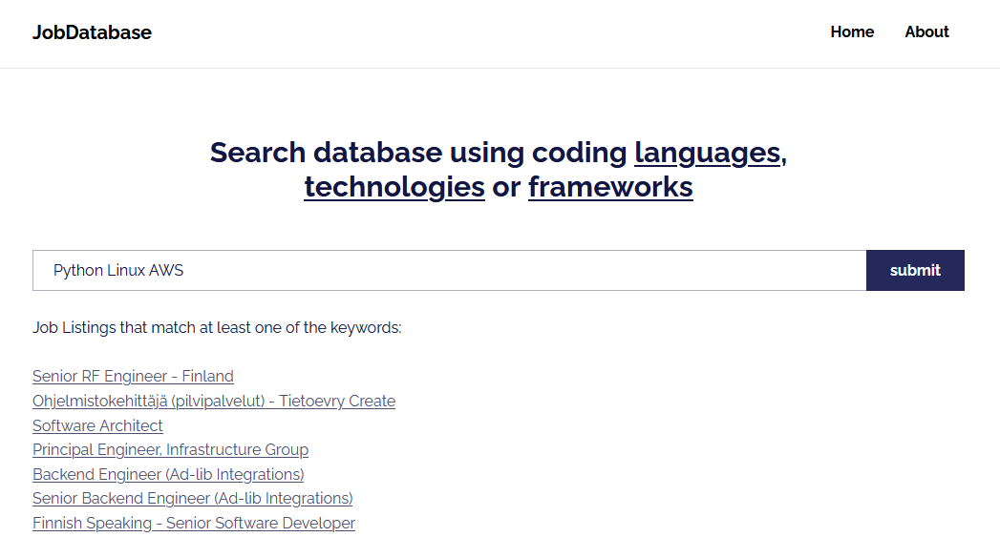

Authors: Asukava & Pskytta, Hive Helsinki Alumni

### What?
A Python web crawler / web app to search the database for IT job postings.

### What does it do?
- crawls through a job listing website in search for job postings for software developer roles.
- it is run once a day and it updates SQLite database with new listings it finds.
- database is accessible via web app at ip: `129.151.211.126`, link --> [JobDatabase](http://129.151.211.126/)

### Deployment
- Deployed on a Oracle Cloud running Oracle Linux 8.8.

Steps we took with the server:
1. setup users and home folders for both of us.
2. connect to the server via SSH.
3. write scripts to update the server.
4. create a group for both users to facilitate permission handling.
6. setup proper security lists in Oracle to enable internet traffic.
8. setup Apache, pip3 and WSGI
9. setup proper firewall rules
10. set crontab for the crawler to update the database once a day.

## What we used
- Python
    - Flask framework
    - SQLite
- Oracle Cloud Infrastructure
- Linux
    - Apache webserver setup
    - WSGI
    - firewall
    - managing system users and permissions
- SSH
- Bash
- Git

## To-Do

- ~~automation for cleaning the database of old job postings.~~
- simplify the code for easier expansion (ongoing)
- expand crawling to other websites (requires the item above).
- a way to filter intern, junior, senior positions
    - ~~requires new SQL database COLUMN~~
- start using https instead of http
    - requires a domain name (when using Let's Cert Certbot)
- ~~database backup and recovery~~
- ~~design simple and more modern frontend~~
- Automation for malicious requests identification from logs

### Additions

- Database backup script added and set on root crontab to run once a day
